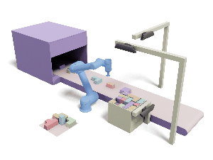

# Packing-Tools
This repo shares our packing tools to provide research convenience for beginners, which includes packing shape processing, rendering tools, and simulation scenarios.

# Continuously updating, please pay attention！

