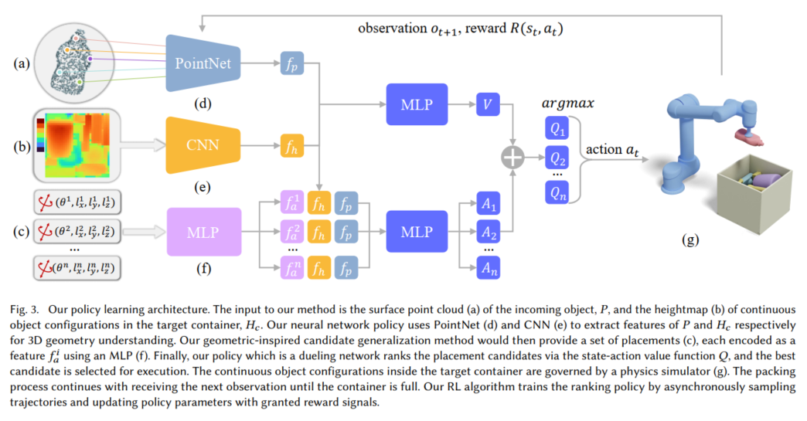

# Packing-Tools
This repo shares our packing tools to provide research convenience for beginners, which includes **simulation scenarios**, **packing shape processing**, and some **rendering & animation tools**, if this repo is helpful for your research, please leave your star to encourage us to share more tools in the future. Any questions, please contact me via alex.hang.zhao@gmail.com :)

### V-rep Simulation Scene

We share our packing scenario implemented in V-REP, which includes a sawyer robot, RGB-D cameras, and a conveyor belt as the following. See the demonstration video here [YouTube](https://www.youtube.com/watch?v=hBzZA_21G3M&t=6s), [bilibili](https://www.bilibili.com/video/BV1st4y1H7kU/?vd_source=b1e4277847248c95062cf16ab3b58e73).

### Packing Shape Processing

We also provide necessary tools for packing shape processing, so that processed packing shapes are compatible with our [irregular packing solver]((https://github.com/alexfrom0815/IR-BPP)) below:

### Packing Scenario Rendering

We also provide some rendering and animation tools for visualizing packing results for better paper writing. See the following example:

