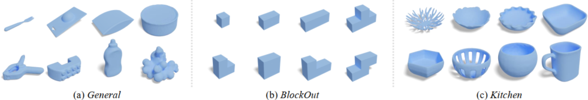
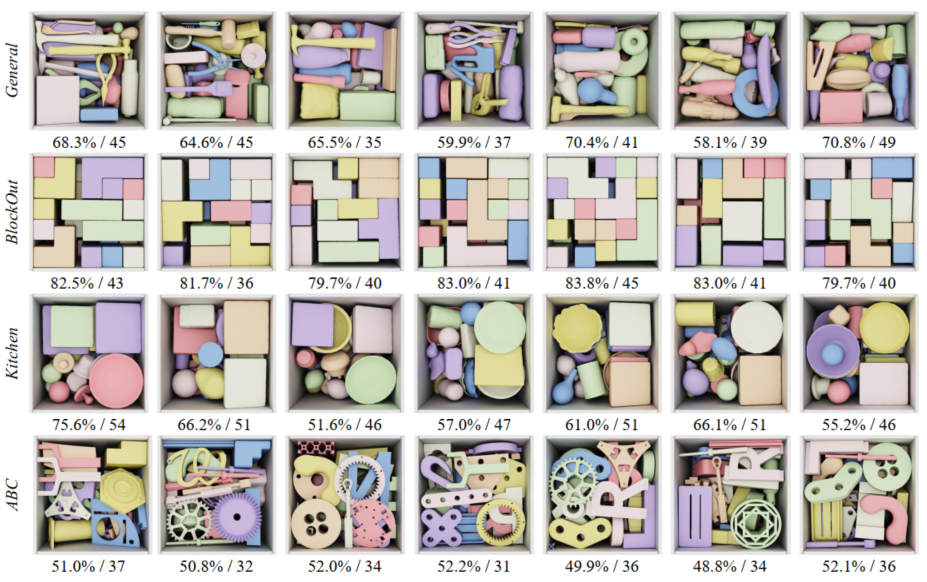

# Packing Scenario Rendering


We provide some rendering and animation tools for visualizing packing results for better paper writing. 
Recommended Blender version: Blender-3.1.2

### Single Object Rendering
```
path/to/your/blender/blender --background --python draw_single_item.py
```



### Draw Many Items Inside the Container

```
path/to/your/blender/blender --background --python draw_many_items_inside_container.py
```


### Packing Scenario Animation
```
path/to/your/blender/blender --background --python packing_scenario_animation.py
```


### ACKNOWLEDGEMENTS
This toolbox is based on [Blender Toolbox](https://github.com/HTDerekLiu/BlenderToolbox).
