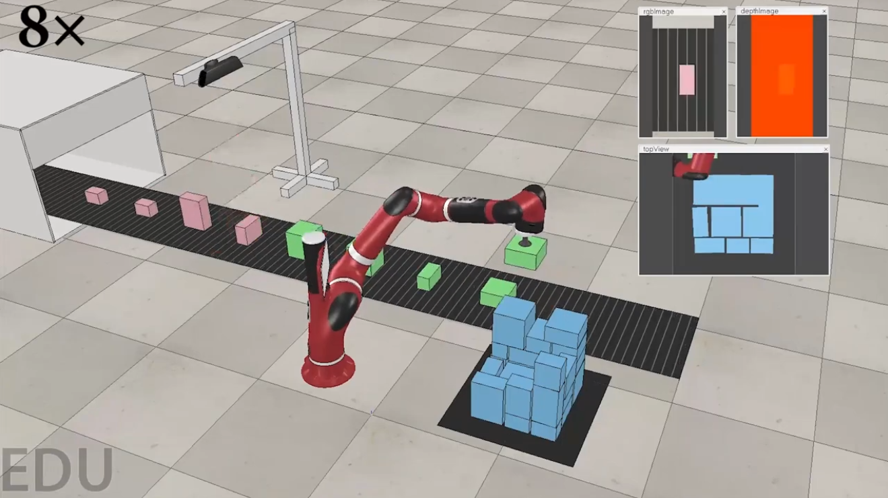

# V-rep simulation scene
Hello guys, this is the repo for the v-rep simulation scenario shown in our AAAI video [YouTube](https://www.youtube.com/watch?v=hBzZA_21G3M&t=6s), [bilibili](https://www.bilibili.com/video/BV1st4y1H7kU/?vd_source=b1e4277847248c95062cf16ab3b58e73). Since so many people are interested in this scenario, I decide to share the demo code here. 

You just need to open ttt files (like [bpp1.ttt](bpp1.ttt)) in the v-rep and run the corresponding python code (like [bpp1.py](bpp1.py)), 
and you can get the following simulation scene which take a sawyer robot, RGB-D cameras, and a converyor belt into packing task consideration.

You may need some basic knowledge about v-rep to understand the code. I recommend you to read the [CoppeliaSim User Manual](https://www.coppeliarobotics.com/helpFiles/). The [visual-pushing-grasping project](https://github.com/andyzeng/visual-pushing-grasping) also provides a good example for helping you to understand the v-rep API.

Note that, this repo just replay some recorded packing results, you may need ajust some functions if you need to make it compatible with your own packing policy.